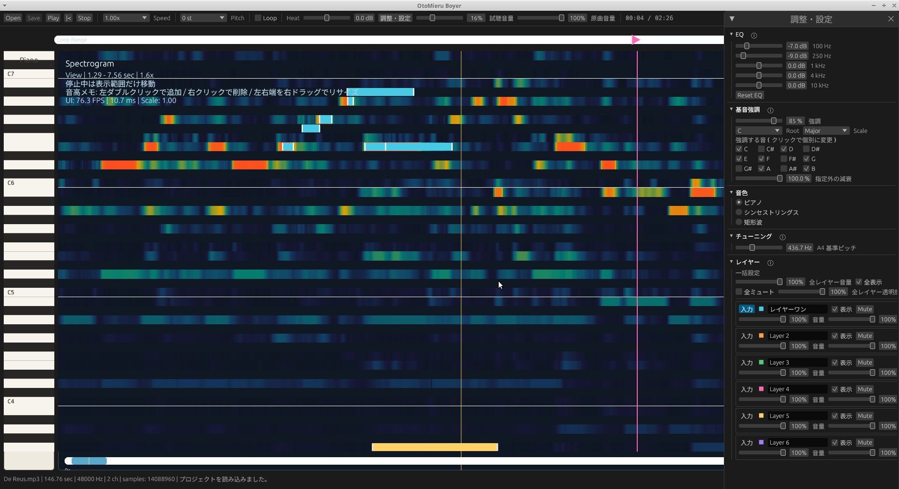

# Otomieru Boyer

Linux向けの耳コピ支援アプリケーションです。音源をスペクトログラムとピアノロールで確認しながら、区間ループ、音程を維持した速度変更、EQ、音高メモを使って音を聴き取れます。



## 主な機能

- WAV / MP3 / FLAC / OGG / M4A / AAC の読み込みと再生
- スペクトログラムとピアノロールによる音高表示
- 再生・一時停止・停止・シーク、タイムラインでの区間ループ
- 音程を保つ速度変更（0.50x〜1.50x）と独立したオクターブシフト
- 5バンドEQ（100 Hz / 250 Hz / 1 kHz / 4 kHz / 10 kHz、各±12 dB）
- 表示専用の基音強調（キー／スケールまたは12音の個別指定）
- スペクトログラム上の確認音、音色選択、A4=430〜450 Hzのチューニング
- 原曲音量と確認音量の独立調整
- 6固定レイヤーの音高メモ作成・移動・削除・リサイズ・Undo
- 音高メモを原曲と同時に再生して確認する答え合わせ再生
- 音源ごとのsidecar JSONへの保存・自動読込

## 基本操作

| 操作 | 内容 |
| --- | --- |
| スペクトログラム上でホイール | 時間軸を拡大／縮小 |
| スペクトログラム上でCtrl＋ホイール | 音高方向を拡大／縮小 |
| 停止中に左クリック | 再生位置を移動し、押下中は対応音を確認 |
| 停止中に左ダブルクリック | 選択中レイヤーへ長さ0.5秒の音高メモを作成 |
| メモ上で右クリック | メモを削除 |
| メモの左右端を右ドラッグ | メモの開始位置または長さを変更 |
| メモ中央を右ドラッグ | メモを時間・音高方向へ移動 |
| `Ctrl+Z` | メモの作成・削除・移動・変更を取り消す |
| `Ctrl+S` または Save | プロジェクトを保存 |

再生中は音高メモの編集を無効にします。メモが重なる場合、選択中レイヤーを優先して操作対象を決めます。

## 調整・設定

ツールバーの`調整・設定`から、リサイズ・スクロール可能なダイアログを開きます。`EQ`、`基音強調`、`音色`、`チューニング`、`レイヤー`はそれぞれ折り畳めます。説明は各見出しのⓘで確認できます。

- `試聴音量`はスペクトログラムを押している間の確認音だけに作用します。
- `原曲音量`は読み込んだ音源の再生音だけに作用します。
- レイヤーごとの表示、Mute、音量、透明度は実行中だけの設定です。起動・再読込時には全レイヤーが「表示ON、Mute OFF、音量100%、透明度100%」へ戻ります。
- レイヤー名と音高メモ、曲固有のEQ・基音強調・チューニングは保存されます。

## 保存ファイル

保存先は音源と同じフォルダの`<音源ファイル名>.otomieru.json`です。例: `song.flac` → `song.flac.otomieru.json`。

保存データには音源照合情報、曲固有設定、6レイヤーのID・名前・音高メモを含めます。レイヤーの表示、Mute、音量、透明度、選択状態、再生速度、オクターブ、原曲音量、確認音量、音色は保存しません。旧ファイルにレイヤーの実行時設定が含まれていても読み込めますが、その値は使用せず初期値へ戻します。

## 描画性能

スペクトログラムは表示幅に合わせて解析フレームを集約し、テクスチャへキャッシュします。再生中はキャッシュ、再生線、ガイド、音高メモだけを描画します。表示範囲、表示サイズ、音程範囲、表示ゲイン、基音強調、EQ、音源が変わったときだけキャッシュを再生成します。

## 動作要件

- Linux の音声出力環境
- Rust（edition 2024対応の安定版）
- Rubber Band Library 3.x の開発パッケージ
- 日本語UI表示用の Noto Sans CJK または IPAex フォント

Ubuntu / Debian系では、次を導入します。

```bash
sudo apt-get install librubberband-dev pkg-config fonts-noto-cjk
```

## ビルドとテスト

```bash
cargo run
cargo test
```

詳細は[全体仕様書](<specification/仕様書.md>)、[v0.3.0 音高メモ仕様書](<specification/v0.3.0 音高メモ仕様書.md>)、[変更履歴](CHANGELOG.md)、[アーキテクチャ](docs/architecture.md)、[外部依存関係と同梱音源](docs/dependencies.md)を参照してください。

## ライセンス

本プロジェクトは[GNU General Public License v2.0 or later](LICENSE)で公開します。音程維持処理に利用するRubber Band LibraryもGPL条件で利用します。
